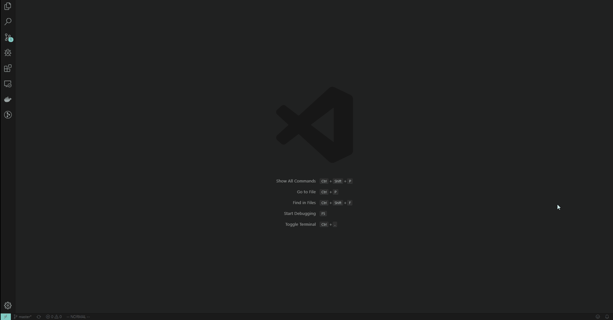

# VS Code Settings

## Usage

To enable [Settings](https://github.com/RodrigoCMoraes/vscode#extensions-and-settings), [Extensions](https://github.com/RodrigoCMoraes/vscode#extensions) and [Keybindings](https://github.com/RodrigoCMoraes/vscode#keybindings) follow the guides below.

### Extensions and Settings

Just copy [.vscode\extensions.json](.vscode/extensions.json) and [.vscode/workspace.code-workspace](.vscode/workspace.code-workspace) structure to your project and VS Code automatically will detect extensions recommendations. And if you want to enable this globally just replace copied to files to your [VS Code User](https://code.visualstudio.com/docs/getstarted/settings) files.

### Keybindings

Just add or replace lines in [.vscode/keybindings.json](.vscode/keybindings.json) by lines in your [VS Code User](https://code.visualstudio.com/docs/getstarted/settings) files.

## Extensions

They are available in [here](.vscode/extensions.json).

### Theme

1. [Material Icon Theme](https://marketplace.visualstudio.com/items?itemName=PKief.material-icon-theme)
1. [Material Theme](https://marketplace.visualstudio.com/items?itemName=Equinusocio.vsc-material-theme) (Theme: Material Theme Darker High Contrast)

### Editing

1. [Vim](https://marketplace.visualstudio.com/items?itemName=vscodevim.vim)
1. [Bracket Pair Colorizer 2](https://marketplace.visualstudio.com/items?itemName=CoenraadS.bracket-pair-colorizer-2)
1. [indent-rainbow](https://marketplace.visualstudio.com/items?itemName=oderwat.indent-rainbow)
1. [Disable Ligatures](https://marketplace.visualstudio.com/items?itemName=CoenraadS.disableligatures)
1. [Path Intellisense](https://marketplace.visualstudio.com/items?itemName=christian-kohler.path-intellisense)
1. [markdownlint](https://marketplace.visualstudio.com/items?itemName=DavidAnson.vscode-markdownlint)

### Git

1. [gitignore](https://marketplace.visualstudio.com/items?itemName=codezombiech.gitignore)
1. [GitLens](https://marketplace.visualstudio.com/items?itemName=codezombiech.gitignore)

### Programming Language Specific

1. [Erlang](https://marketplace.visualstudio.com/items?itemName=pgourlain.erlang)
1. [Python](https://marketplace.visualstudio.com/items?itemName=ms-python.python)
1. [Code Runner](https://marketplace.visualstudio.com/items?itemName=formulahendry.code-runner)

### General

1. [Docker](https://marketplace.visualstudio.com/items?itemName=ms-azuretools.vscode-docker)
1. [Remote Development Extension Pack](https://marketplace.visualstudio.com/items?itemName=ms-vscode-remote.vscode-remote-extensionpack)

## Settings

They are available in [here](.vscode/workspace.code-workspace).

Just copy [.vscode/workspace.code-workspace](.vscode/workspace.code-workspace) structure to your project and VS Code automatically will detect extensions recommendations. And if you want to enable this globally just replace copied to files to your [VS Code User](https://code.visualstudio.com/docs/getstarted/settings) files.

## Font

I personally like [Iosevka](https://typeof.net/Iosevka/), because it's monospaced, accept ligature and of course is pretty ;).

To install it in your system, just follow the official [README.md](https://github.com/be5invis/Iosevka/blob/master/README.md). I use [iosevka-ss08-2.3.2](https://github.com/be5invis/Iosevka/releases/download/v2.3.2/iosevka-ss08-2.3.2.zip) with Iosevka Medium. The files that I used to install are available in [here](https://github.com/RodrigoCMoraes/vscode/tree/master/fonts).
